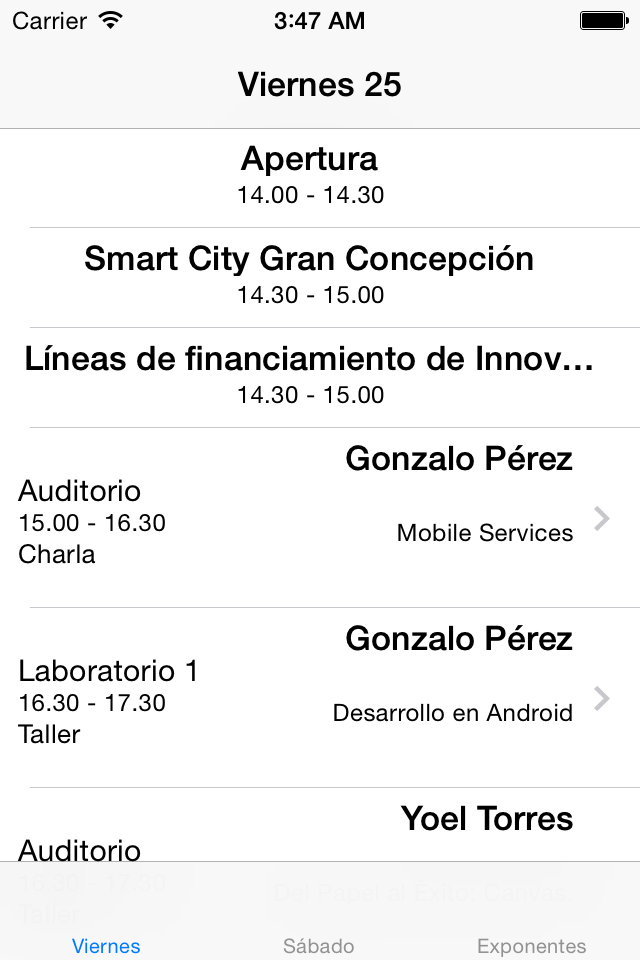
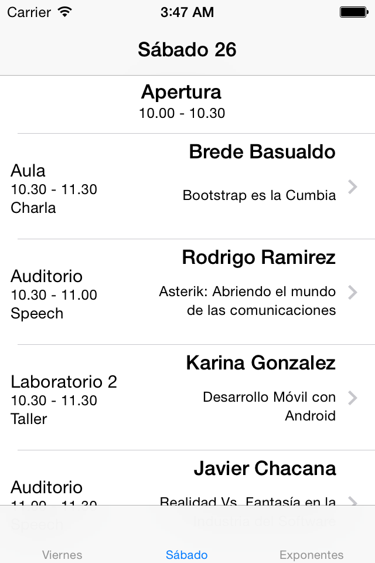
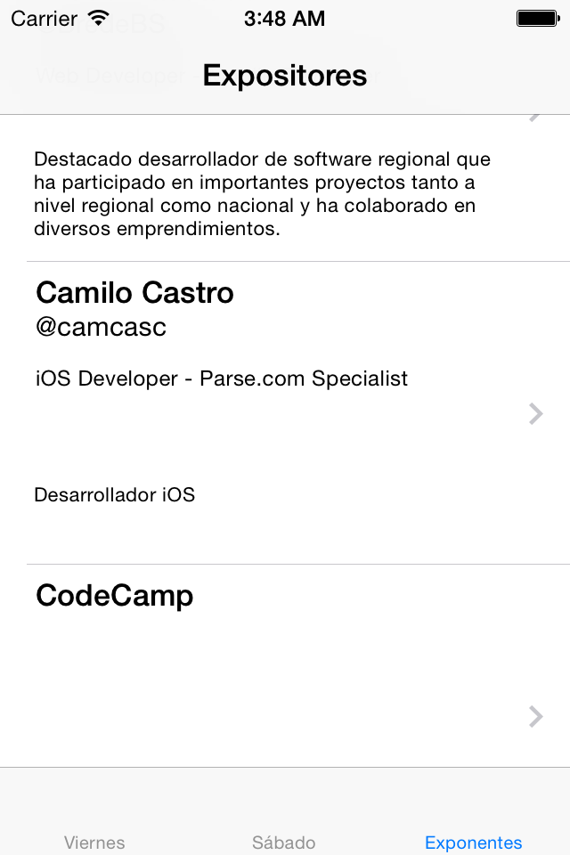

# Demo Aplicación CodeCamp BioBio 2014
La siguiente es una aplicación para iOS que utiliza Parse.com para obtener datos. Los datos fueron importados a Parse usando el código fuente en importar-datos.

